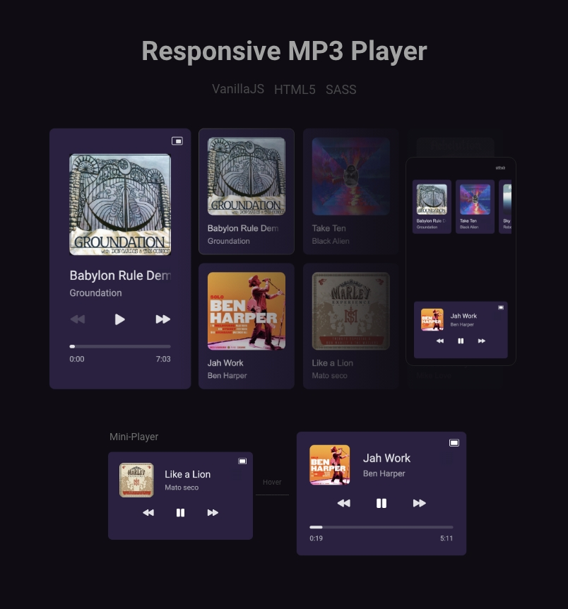

#

**Description** 
- MP3 player developed for a <a href="https://boracodar.dev/?utm_source=linktree&utm_medium=organic&utm_campaign=lead&utm_term=boracodar&utm_content=lead-boracodar-other-organic-none-none-boracodar_desafio1-6-janeiro-linktree">Challenge</a> from <a href="https://www.rocketseat.com.br/">@Rocketseat</a>. 

- <a href="https://mp3-player-six.vercel.app/">Deployed on @Vercel</a>

**Tech stack** 
- HTML5 
- CSS/Sass
- Vanilla Javascript

**Features** 
- Play
- Pause
- Next
- Prev
- Miniplayer mode
- Accessibilities
- 100% Responsive

**Accessibilities key details**
- (Space) for play and pause
- (Arrows right and left) to go to prev and next songs
- (Arrows up and down) to handle volumes
- (Escape) for quit miniPlayer mode view

**Starting working on this project**
* The only requirement to customize this project is having <a href="https://sass-lang.com/">SASS</a> installed on your machine and basic knowledges of HTML, CSS and Javascript.

<i>After having SASS installed globally on your machine, run the command above on the project's root folder.</i>
   
<pre>
sass --watch styles/scss/styles.scss styles/css/styles.css
</pre>
