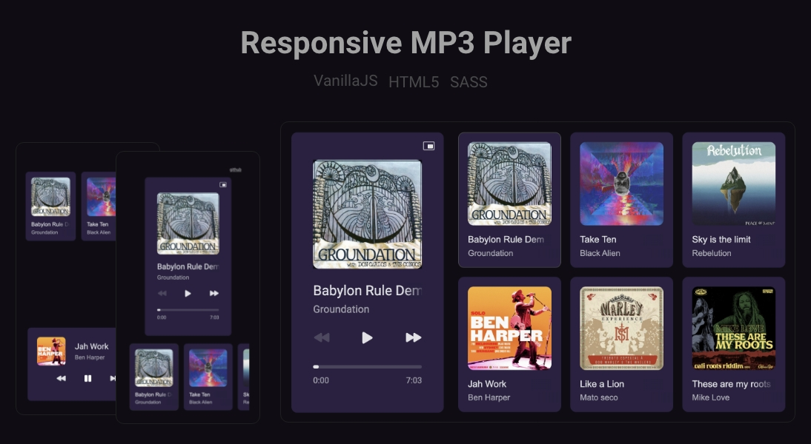

#

**Description** 
- MP3 player developed for a <a href="https://boracodar.dev/?utm_source=linktree&utm_medium=organic&utm_campaign=lead&utm_term=boracodar&utm_content=lead-boracodar-other-organic-none-none-boracodar_desafio1-6-janeiro-linktree">Challenge</a> from <a href="https://www.rocketseat.com.br/">@Rocketseat</a>. 

- <a href="https://mp3-player-six.vercel.app/">Deployed on @Vercel</a>

**Tech stack** 
- HTML5 
- CSS/Sass
- Vanilla Javascript

**Features** 
- Play
- Pause
- Next
- Prev
- Miniplayer mode
- Accessibilities
- 100% Responsive

**Accessibilities key details**
- (Space) Play and Pause
- (Arrows Right and Left) - Prev and Next track
- (Arrows Up and Down) - Volume handling
- (Escape) Quit Miniplayer
